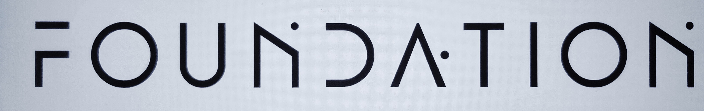
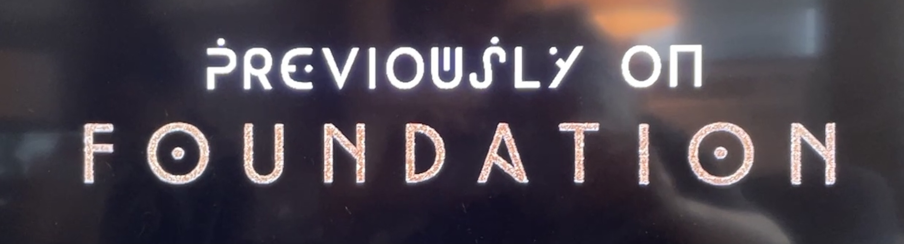
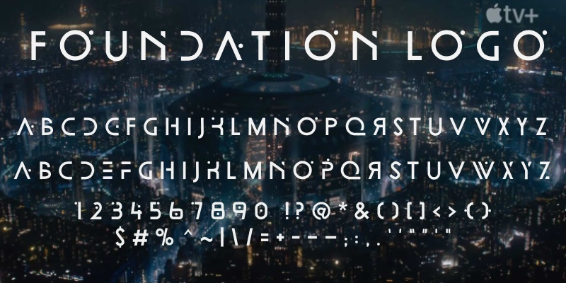

# Foundation Logo

A font containing the specific design of letters used for the Foundation logo, in the Apple TV+ series based on the Isaac Asimov books.

Since, by definition, only the seven letters used in the word ”Foundation“ comprise the glyphset of the logo, all the other characters, numbers, symbols and punctuation are conjectures.

One surprising aspect of the Foundation logo is that the Apple TV+ series has used two different logos:

And beyond that, the type design used in the title sequence is also used, when “Previously on Foundation” is announced.

The characters used in the word “Foundation” in the image above form the basis of the <a href="https://github.com/rsperberg/foundation-titles-hand" title="Jump to Foundation Titles repo">Foundation Titles</a> font, and the other text is the basis for the <a href="https://github.com/rsperberg/foundation-one" title="Jump to Foundation Titles repo">Foundation One</a> font, both OFL-licensed and both here on GitHub.  A <a href="https://github.com/rsperberg/foundation-screen" title="Jump to Foundation Screen repo">font</a> based on the type design seen on computer screens in Foundation is also planned.

Here is version 0.3 of Foundation Logo, with caps only but including alternate versions of E, F, K, P, S, W, X, Y and Z (coverage of the full Basic Latin codeblock).

The source .ifm2archive files are in the file format used by iFontMaker, the iPad font-design tool made by Eiji and Tom, Inc., which you can find at <a href="http://2ttf.com/" title="Jump to 2ttf.com">2ttf.com</a>. To install Foundation Logo on an iPhone or iPad, use the command “Install (for iOS)” at <a href="https://2ttf.com/BW7GxybNOS0" title="Jump to 2ttf.com/BW7GxybNOS0">2ttf.com/BW7GxybNOS0</a>.

